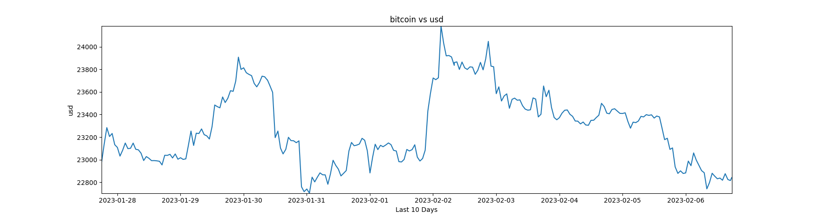

# Visualize the Crypto market with the `CoinGecko` API
Create custom Cryptocurrency charts via the [CoinGecko API](https://www.coingecko.com/en/api/documentation). This project doesn't require a paid `CoinGecko` API plan, it uses the API's free service (rate limit of 10-50 calls/minute).

# Dependencies
Install all dependencies with:
```bash
$ pip3 install requirements.txt
```

# Quick Start
``` bash 
$ python3 crypto_data.py   
```
# Example
BTC vs USD chart over the last 10 days:

